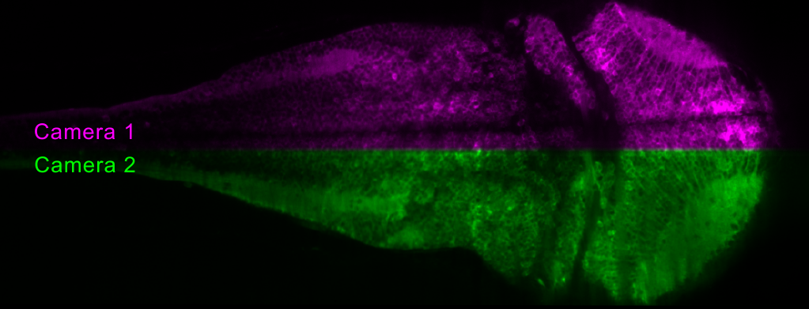

# StitchDPI.jl
[](https://github.com/HolyLab/StitchDPI.jl/actions/workflows/CI.yml)[](https://codecov.io/gh/HolyLab/StitchDPI.jl)

Package for stitching images acquired with a Distributed Planar Imaging system, as published in:



Please see the publication for the full rationale of this package.  Below is a brief guide to use.

This package performs stitching in two steps:

1. Find a coordinate transformation that maps the images acquired by one camera in a DPI system to images acquired with another camera.  This is done by aligning a set of calibration images.  We recommend imaging fluorescent beads for this step.
2. Apply the transformation to each image from the coordinate-transformed camera and generate a stitched image containing data from both cameras.  Typically there will be a strip of overlap between the two images.  This package provides a type, `StitchedSeries`, to perform this stitching "lazily" (images are computed on-demand, making it unnecessary to create a persistent copy of the whole dataset).

In order to use this package correctly for these tasks the calibration images must be acquired with the protocol below (directions are specific to the WUCCI OCPI microscope):

1. Install the knife-edged mirror (KEM).  Make sure the KEM is positioned so that both cameras stay in-focus.
2. Set vertical camera ROIs as desired (should be same size for both cameras).
3. Move "camera 1" up so that the KEM line corresponds with the bottom side of the ROI (larger ROIs will require moving the camera farther).
4. Move "camera 2" left so that the KEM line corresponds with the bottom side of the ROI.
5. Note the ROI settings and change the ROI to full chip.
6. Swap out the KEM for the 50/50 beamsplitter.
7. Take a snapshot of beads with camera 2.
8. Reset ROIs as noted in #5, replace KEM mirror, and take a snapshot with each camera.  Make sure the beads don't move during this sequence!

The three images recorded with this protocol can be passed to the `stitch_tfm` function to find the aligning transformation, as below:

```julia
#cam2_img_full was acquired in protocol step 7, cam1_img_roi and cam2_img_roi were acquired in step 8.
#kwargs can include any valid keyword argument to the registration functions in the RegisterQD.jl package
tfm = stitch_tfm(cam2_img_full, cam1_img_roi, cam2_img_roi; kwargs...)
```

After this transformation is found it may be applied to stitch any pair of images acquired with the cameras with the chosen ROI:

```julia
#ysz_full should correspond to the full full vertical ROI size of the camera used during calibration (the size of the image acquired in step 7)
img = stitch(cam1_img_roi, cam2_img_roi, tfm; ysz_full=2048)
```

The above function works fine for a single pair of images, but this package also provides an array type useful for "lazy" stitching of large 3D + time datasets:

```julia
#cam1_img_roi and cam2_img_roi are 4D images (3D+time) where each camera frame spans the first two dimensions
ss = StitchedSeries(cam1_img_roi, cam2_img_roi, tfm)
```

Note there are also utilities for writing large datasets to disk in `write_to_disk.jl`, and the green-magenta overlay shown at the top of this page was created with the `stitched_mg_overlay` function.
